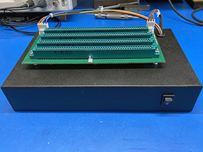
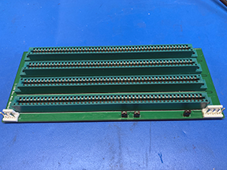
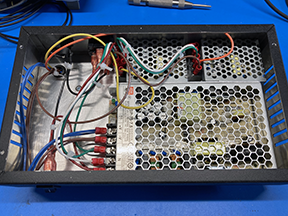
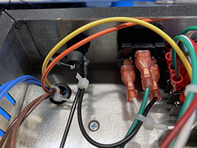

## A 4-slot S-100 bus mini-backplane with power supply chassis.

#### Description

This is a 4-slot S-100 bus mini-backplane with power supply chassis.

It is intended for someone interested in building and running S-100 bus cards, possibly as a first project or for use on a test bench.

Features:
- 4 slots.
- Chassis is designed for three Mean Well switching power supplies to provide 8V, 16V, and -16V in one unit. The maximum 8V current is 10 amps.
- Jumpers to ground for S-100 pins 20, 53, and 70. Some pre-IEEE-696 cards use these pins for signals where IEEE-696 defines these pins as grounds.
- Connector for a reset switch.

#### Mini-backplane Design Files

The mini-backplane design files in KiCad 7 are in the kicad directory.

The generated mini-backplane Gerber and drill files are in the file mini-backplane-gerbers.zip.

#### Chassis Design Files

The bill of materials is in the bom directory.

There is a poorly-executed layout drawing for the chassis holes in the chassis directory.

At maximum output power the power supplies will dissipate ~10W. A simple thermal
analysis indicated that cooling would be OK without any holes in the chassis.
However, I have a friend with a CNC mill who was willing mill the chassis, so I
added the cooling slots as shown on the drawing.

#### Chassis Assembly Notes

The chassis is tight, if I built this again I would select a slightly larger chassis. The height is OK, but a chassis that was an inch or two longer and wider would make it easier to wire and install the power supplies.

The power switch didn’t sit tight in its mounting hole. The chassis wall thickness is 0.040 inch and the switch might have been designed for a thicker walled chassis. I used some hot glue on the switch to keep it from moving.

Wait to install the IEC power connector until you have the power supplies installed. You will need clearance to install the 16V and -16V power supplies.

#### Assembly Steps

1. Make up the wires that will go to the IEC power connector quick connect terminals.
1. Make up the wires that go from the backplane connectors to the power supplies.
1. Wire the 16V and -16V power supplies to each other and the backplane cables.
1. Wire the fuse holder and power switch.
1. Epoxy two of the 4-40 by 1 inch flat-headed screws that hold the mini-backplane to the chassis. They will be hidden by the installed power supplies.
1. Mount the 8V supply and wire to the switch and IEC connector wires.
1. Mount the 16V and -16V supplies. They will fit in but it will take some persuasion.
1. Install the IEC power connector. Finish installing all the wiring.
1. Complete by mounting the backplane on the chassis.
